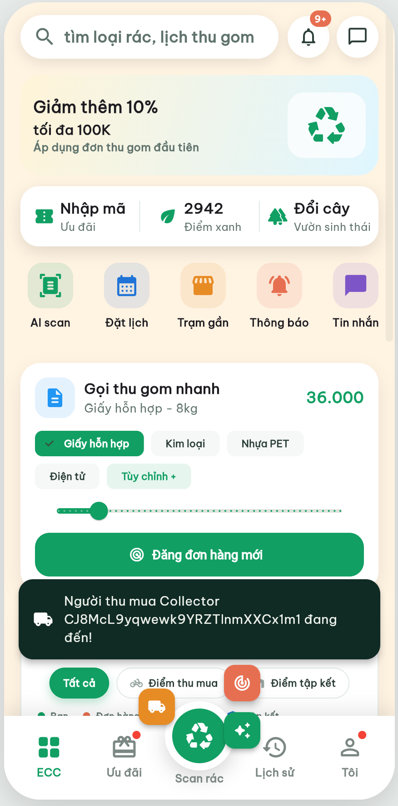
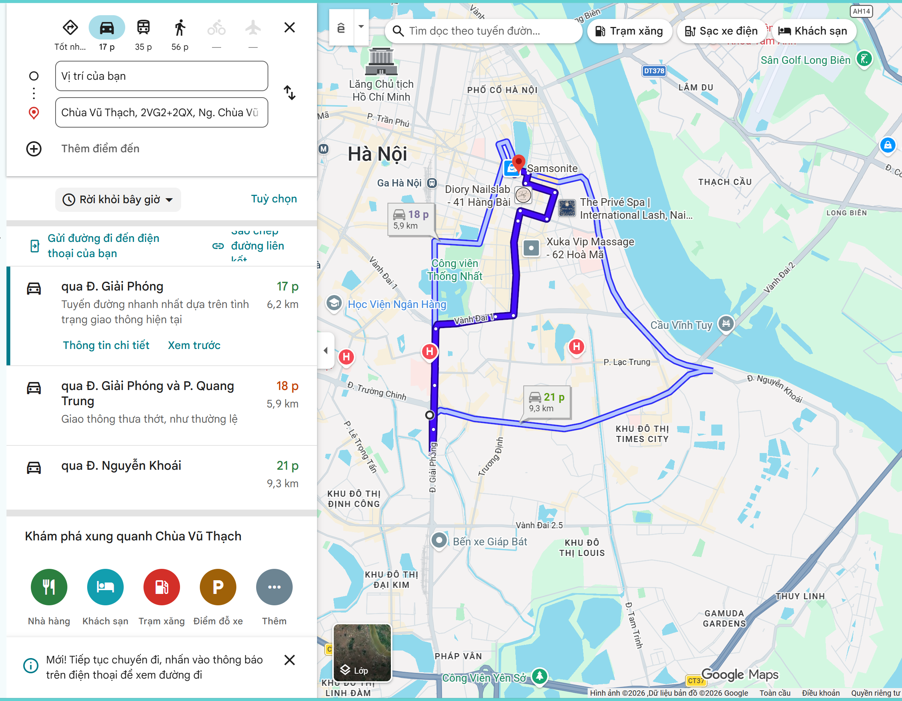
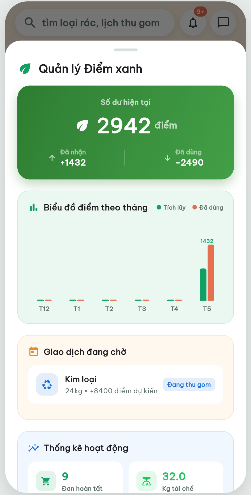
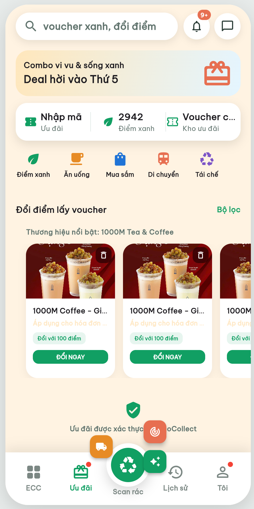
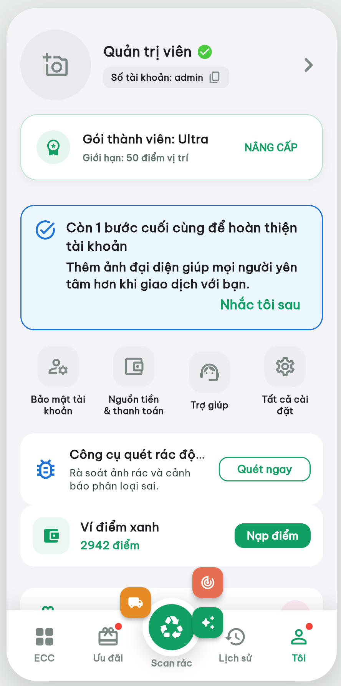
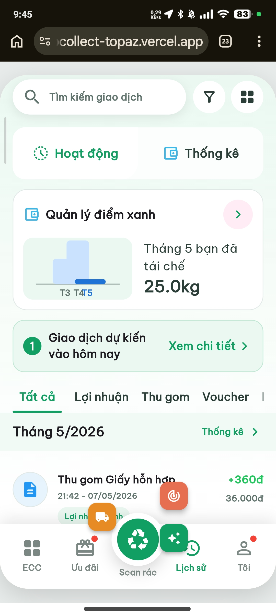
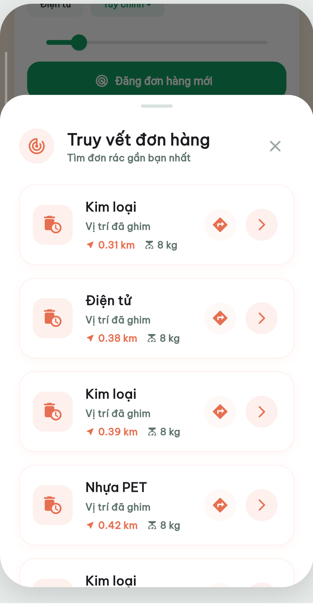

# ♻️ EcoCollect — Nền tảng "Đồng nát 4.0" 📱

[](https://github.com/minhkaiyo/ecocollect_mobile)
[](https://dart.dev/)
[](https://flutter.dev/)
[](https://firebase.google.com/)

<p align="center">
  
</p>

## 💡 Concept
**EcoCollect** là một hệ sinh thái kỹ thuật số hiện đại hóa ngành thu gom phế liệu tại Việt Nam. Ứng dụng kết nối trực tiếp:
1. **Người bán**: Hộ gia đình, cá nhân có phế liệu cần xử lý.
2. **Người thu gom (Collectors)**: Những người thu mua tự do được tối ưu hóa tuyến đường.
3. **Trạm tập kết**: Các điểm tái chế và xử lý rác thải chuyên nghiệp.

Mục tiêu của dự án là thúc đẩy nền kinh tế tuần hoàn, tăng tỷ lệ tái chế và cải thiện thu nhập cho người lao động tự do.

---

## 📸 Giao diện Ứng dụng

<p align="center">
  
  
  
</p>

<p align="center">
  
  
  
</p>

---

## ✨ Tính năng nổi bật

- **🔍 Thu gom thông minh**: Gọi người thu mua chỉ với vài thao tác, ước tính giá trị phế liệu dựa trên loại và khối lượng.
- **🗺️ Bản đồ Radar Real-time**: Theo dõi vị trí người thu gom, trạm tập kết và heatmap khu vực có nhu cầu cao.
- **💎 Ví Điểm Xanh (Eco-Points)**: Tích điểm sau mỗi lần giao dịch thành công để đổi các voucher quà tặng hấp dẫn.
- **📊 Bảng giá thị trường**: Cập nhật giá phế liệu theo thời gian thực (nhôm, đồng, nhựa, giấy...).
- **🛠️ Công nghệ AI (Demo)**: Scan nhận diện loại phế liệu qua camera.
- **📈 Quản lý tuyến đường**: Dành cho người thu mua để tối ưu hóa quãng đường di chuyển.

---

## 🛠 Tech Stack

- **Frontend**: Flutter (Dart) với State Management tối ưu.
- **Backend**: Firebase (Authentication, Cloud Firestore, Firebase Storage).
- **Maps**: `flutter_map` kết hợp dữ liệu OSM & OpenRouteService.
- **Animations**: `flutter_animate` cho UI mượt mà, sống động.
- **AI Integration**: TFLite Flutter (Demo scan phế liệu).

---

## 🚀 Cài đặt & Chạy thử

### Yêu cầu
- Flutter SDK (phiên bản mới nhất)
- Android Studio / VS Code với Flutter plugin

### Các bước thực hiện
```powershell
# 1. Clone repository
git clone https://github.com/minhkaiyo/ecocollect_mobile.git

# 2. Cài đặt dependencies
flutter pub get

# 3. Chạy ứng dụng (Chrome/Android/iOS)
flutter run
```

---

**Developed by Pham Van Minh - Hanoi University of Science and Technology.**
